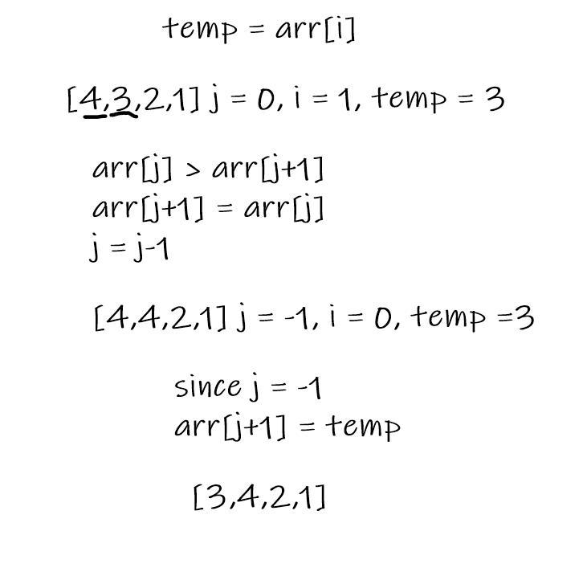
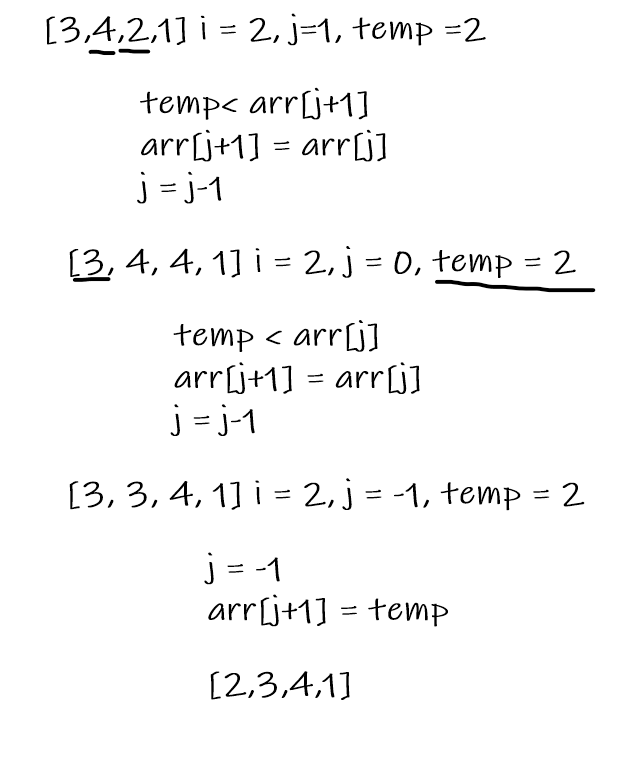
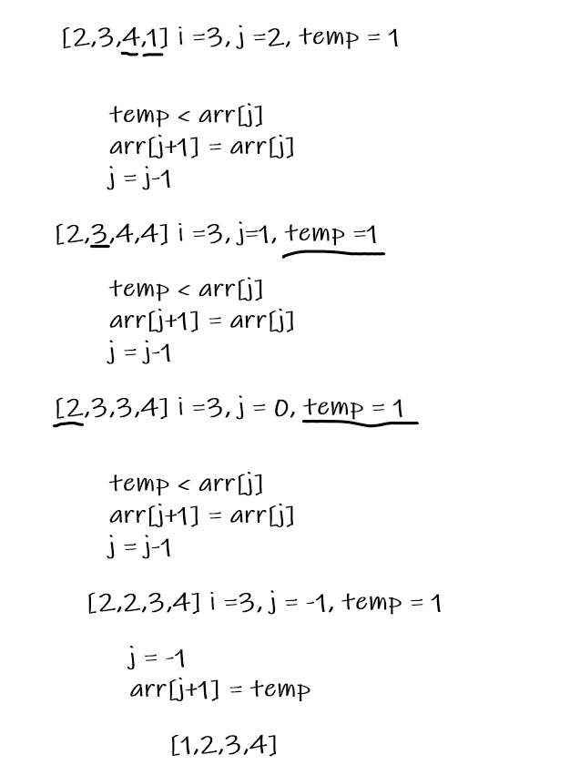

# Insertion Sort

In this method, an array is sorted using the insertion sort method. The array is loop through starting at index 1, where the value is compared with values at previous indexes (at j index). If the value at previous indexes is found to be greater than value at index i, it takes the place of index i. When a value at a previous index is found to be less than value at index i, index i is placed in the index right after that one (j+1).

Pseudo Code

        InsertionSort(int[] arr)
  
        FOR i = 1 to arr.length
        
        int j <-- i - 1
        int temp <-- arr[i]
        
        WHILE j >= 0 AND temp < arr[j]
            arr[j + 1] <-- arr[j]
            j <-- j - 1
            
        arr[j + 1] <-- temp

## Trace

Sample Array: [4,3,2,1]

Pass 1:

Pass 2:

Pass 3:

## Efficency

Time: O(n^2)

The method has nested loops

Space: O(1)
Only the temp variable is used to keep track of value at arr[i]
