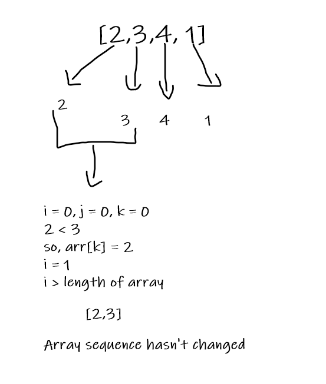
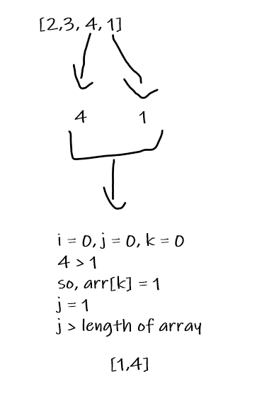
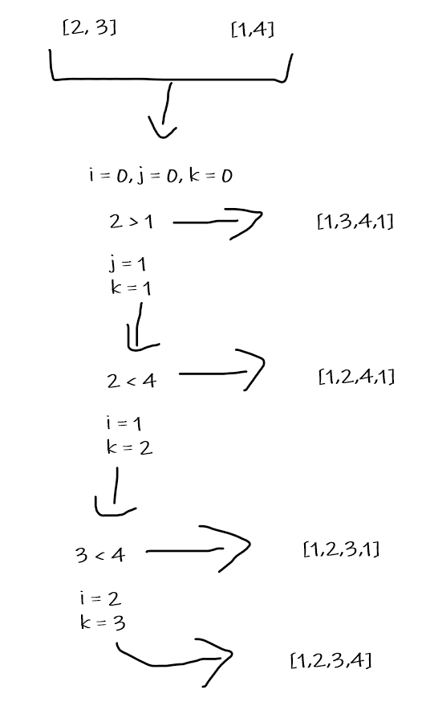

# Merge Sort

A merge sort is an efficient way of sorting an array. It divides an array into two subarrays and continues each subarray into multiple subarraries until each array is of length 1. Then it compares two values and changes positions of the values in the array depending on the result of the comparision.

Pseudocode

       ALGORITHM Mergesort(arr)
    DECLARE n <-- arr.length
           
        if n > 1
        DECLARE mid <-- n/2
        DECLARE left <-- arr[0...mid]
        DECLARE right <-- arr[mid...n]
        // sort the left side
        Mergesort(left)
        // sort the right side
        Mergesort(right)
        // merge the sorted left and right sides together
        Merge(left, right, arr)

    ALGORITHM Merge(left, right, arr)
        DECLARE i <-- 0
        DECLARE j <-- 0
        DECLARE k <-- 0

        while i < left.length && j < right.length
            if left[i] <= right[j]
                arr[k] <-- left[i]
                i <-- i + 1
            else
                arr[k] <-- right[j]
                j <-- j + 1
                
            k <-- k + 1

        if i = left.length
        set remaining entries in arr to remaining values in right
        else
        set remaining entries in arr to remaining values in left

## Trace

Sample Array: [2,3,4,1]

Pass 1:

Pass 2:

Pass 3:

## Efficency

Time: O(n log n)

The method includes dividing an array into subarrays

Space: O(n log n)
