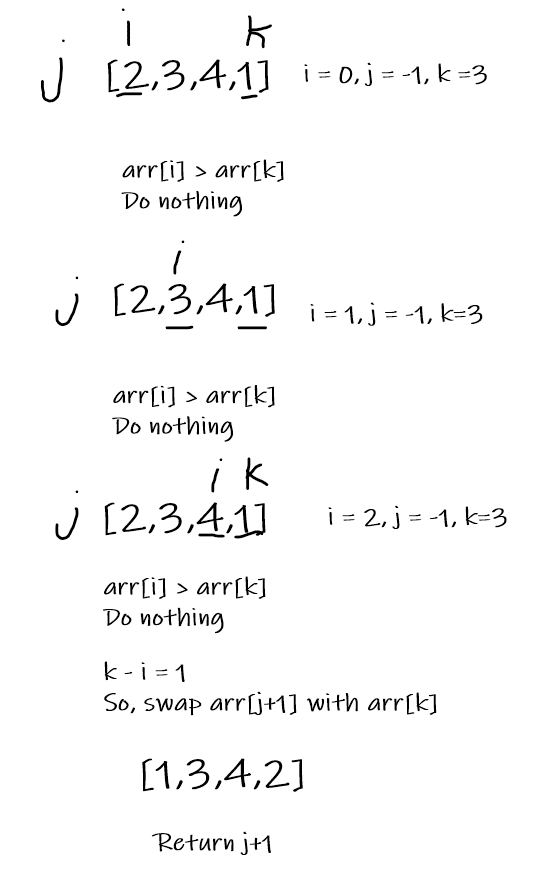
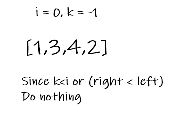
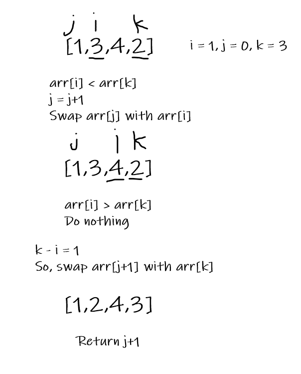
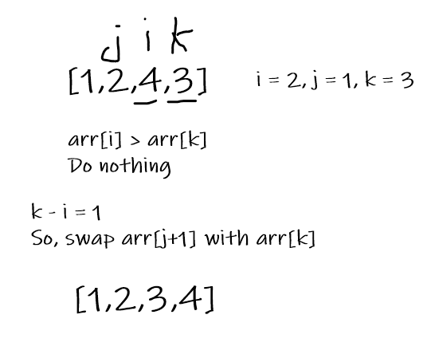

# Quick Sort

Quick sort is a divide-and-conquer algorithmn. First, a pivot is selected (usually last value in an array), then the array is partitioned into two subarrays where the left subarray where the left subarray must contain values less than the pivot and right subarray must contain values greater than the pivot

Pseudocode

        ALGORITHM QuickSort(arr, left, right)
            if left < right
                // Partition the array by setting the position of the pivot value 
                DEFINE position <-- Partition(arr, left, right)
                // Sort the left
                QuickSort(arr, left, position - 1)
                // Sort the right
                QuickSort(arr, position + 1, right)

        ALGORITHM Partition(arr, left, right)
            // set a pivot value as a point of reference
            DEFINE pivot <-- arr[right]
            // create a variable to track the largest index of numbers lower than the defined pivot
            DEFINE low <-- left - 1
            for i <- left to right do
                if arr[i] <= pivot
                    low++
                    Swap(arr, i, low)

            // place the value of the pivot location in the middle.
            // all numbers smaller than the pivot are on the left, larger on the right. 
            Swap(arr, right, low + 1)
            // return the pivot index point
            return low + 1

        ALGORITHM Swap(arr, i, low)
            DEFINE temp;
            temp <-- arr[i]
            arr[i] <-- arr[low]
            arr[low] <-- temp

## Trace

Sample Array: [2,3,4,1]

Pass 1:

Pass 2:

Pass 3:

Pass 3:

## Efficency

Time: O(n log n)

The method includes dividing an array into subarrays

Space: O(n log n)
